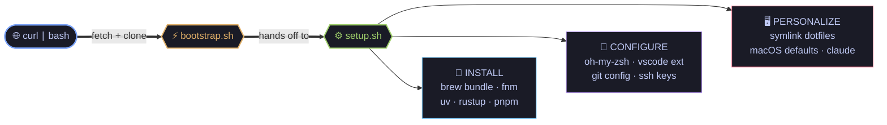

<div align="center">

```

         ██████╗  ██████╗ ████████╗███████╗██╗██╗     ███████╗███████╗
         ██╔══██╗██╔═══██╗╚══██╔══╝██╔════╝██║██║     ██╔════╝██╔════╝
         ██║  ██║██║   ██║   ██║   █████╗  ██║██║     █████╗  ███████╗
         ██║  ██║██║   ██║   ██║   ██╔══╝  ██║██║     ██╔══╝  ╚════██║
         ██████╔╝╚██████╔╝   ██║   ██║     ██║███████╗███████╗███████║
         ╚═════╝  ╚═════╝    ╚═╝   ╚═╝     ╚═╝╚══════╝╚══════╝╚══════╝
```

```
        ╔══════════════════════════════════════════════════════════════╗
        ║  > SYSTEM: macOS · ARCH: arm64 · STATUS: [ READY ]           ║
        ║  > OPERATOR: escalonc · UPLINK: 1Password · MODE: solo dev   ║
        ╚══════════════════════════════════════════════════════════════╝
```

[](https://git.io/typing-svg)


</div>

---

```bash
$ curl -fsSL https://raw.githubusercontent.com/escalonc/dotfiles/main/bootstrap.sh | bash
```

```
░░░░░░░░░░░░░░░░░░░░░░░░░░░░░░░░░░░░░░░░░░░░░░░░░░░░░░░░░░░░  100%

[ OK ] kernel handshake          [ OK ] toolchain forge
[ OK ] homebrew core             [ OK ] vscode extensions
[ OK ] oh-my-zsh + p10k          [ OK ] symlink dotfiles → $HOME
[ OK ] fnm · uv · rustup         [ OK ] macOS defaults rewritten
```

---

## `>_ ./payload --list`

<table>
<tr><td valign="top" width="50%">

**`SHELL & TERMINAL`** `[01]`

```
► zsh ............ default shell
► oh-my-zsh ...... framework
► powerlevel10k .. prompt
► 23 plugins ..... loaded
► ghostty ........ GPU terminal
► warp ........... AI terminal
► zellij ......... multiplexer
```

`████████████ ONLINE`

</td><td valign="top" width="50%">

**`CLI ARSENAL`** `[02]`

```
► bat ........... cat++
► eza ........... ls with icons
► fd ............ find, faster
► rg ............ ripgrep
► fzf ........... fuzzy finder
► zoxide ........ smarter cd
► atuin ......... history search
► delta ......... pretty diffs
► lazygit ....... git TUI
► yazi .......... file manager
```

`████████████ ARMED`

</td></tr>
<tr><td valign="top">

**`LANGUAGES & RUNTIMES`** `[03]`

```
► node ......... via fnm
► python ....... via uv (100×)
► rust ......... via rustup
► pnpm ......... supply-safe
```

> *rust > legacy. always.*

`████████████ LIVE`

</td><td valign="top">

**`macOS TUNING`** `[04]`

```
► dark mode + liquid glass
► dock: autohide, no delay
► keyboard: fast repeat
► trackpad: tap-to-click
► finder: list view, folders 1st
► screenshots → ~/Pictures
► true tone ............ OFF
```

`████████████ TUNED`

</td></tr>
</table>

---

## `>_ tree ~/.dotfiles`

```
~/.dotfiles/
│
├── ⚡ bootstrap.sh ··············· curl|bash entry · installs brew · clones repo
├── ⚙  setup.sh ··················· orchestrator · 9 phases · idempotent
├── 🍺 Brewfile ··················· 44 formulae · 25 casks · 5 fonts
│
├── 📁 dotfiles/  ·················· symlinked into $HOME
│   ├── .zshrc ···················· shell config
│   ├── .gitignore_global ········· global ignore rules
│   └── .ssh/config ··············· 1Password SSH agent
│
└── 📁 scripts/  ··················· orchestrator modules
    ├── helpers.sh ················ colors · logging
    ├── shell.sh ·················· oh-my-zsh + 23 plugins
    ├── languages.sh ·············· fnm · uv · rustup
    ├── packages.sh ··············· pnpm globals · uv tools
    ├── vscode.sh ················· 26 extensions
    ├── git.sh ···················· config · aliases · delta
    ├── macos.sh ·················· system defaults
    └── claude.sh ················· claude code install
```

---

## `>_ ./how-it-works`



**Already provisioned?** Re-run anytime — it's idempotent.

```bash
cd ~/.dotfiles && git pull && ./setup.sh
```

---

## `>_ ./customize`

```
WHEN YOU WANT TO...               EDIT THIS FILE

► add a CLI tool                  Brewfile                 brew ""
► add a GUI app                   Brewfile                 cask ""
► change shell config             dotfiles/.zshrc
► add a VS Code extension         scripts/vscode.sh
► tweak macOS defaults            scripts/macos.sh
► add a global pnpm package       scripts/packages.sh
► machine-specific overrides      ~/.zshrc.local       (untracked)
```

---

## `>_ ./post-install --checklist`

```
HUMAN-IN-THE-LOOP STEPS

[ ] restart terminal           ── or: source ~/.zshrc
[ ] p10k configure             ── pick your prompt vibe
[ ] 1password → ssh agent      ── settings · developer · enable
[ ] gh auth login              ── github cli login
[ ] claude                     ── authenticate claude code
[ ] orbstack + raycast         ── first-launch dance
[ ] terminal font              ── JetBrains Mono Nerd Font
[ ] displays                   ── uncheck True Tone
[ ] restart mac                ── one final cleanse

finished? ──────────────────────────> you are operational.
```

---

## `>_ cat philosophy.txt`

```
▸ personal, not general ............. one developer, no committee
▸ modern over legacy ................ rust rewrites win
▸ minimal globals ................... pnpm > npm · supply hygiene
▸ idempotent by design .............. run once or ten times
▸ no magic .......................... shell scripts, 5 min read
▸ keyboard > mouse .................. fzf · zoxide · lazygit
```

> *"your machine should feel like an extension of your hand,
> not someone else's idea of a default."*

---

<div align="center">

```
   ░░░░░░░░░░░░░░░░░░░░░░░░░░░░░░░░░░░░░░░░░░░░░░░░░░░░░░░░░░░░░░░░░
   ▒▒▒▒▒▒▒▒▒▒▒▒▒▒▒▒▒▒▒▒▒▒▒▒▒▒▒▒▒▒▒▒▒▒▒▒▒▒▒▒▒▒▒▒▒▒▒▒▒▒▒▒▒▒▒▒▒▒▒▒▒▒▒▒▒
   ▓▓▓▓▓▓▓▓▓▓▓▓▓▓▓▓▓▓▓▓▓▓▓▓▓▓▓▓▓▓▓▓▓▓▓▓▓▓▓▓▓▓▓▓▓▓▓▓▓▓▓▓▓▓▓▓▓▓▓▓▓▓▓▓▓
   █████████████████████████████████████████████████████████████████
```

[](https://git.io/typing-svg)

```
END OF TRANSMISSION
```

</div>
